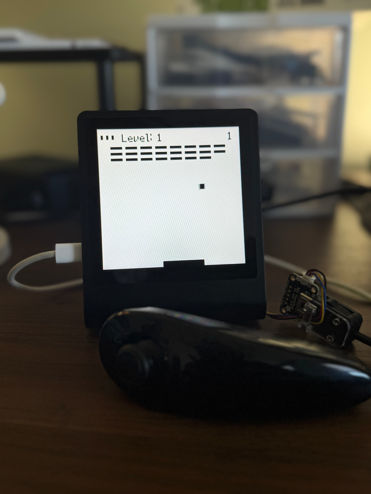

# Breakout on the Pimoroni Presto
This is a port [gameESP-micropython](https://github.com/cheungbx/gameESP-micropython)'s breakout to run on the Pimoroni Presto using a Wii nunchuk as the controller.

## Special thanks and libraries used
- Game logic ported from [gameESP-micropython](https://github.com/cheungbx/gameESP-micropython). All credit goes to them for any game logic. I just moved the classes over and changed it to use the Presto
- [adafruit_nunchuk.py](./adafruit_nunchuk.py) is a port to MicroPython from the [Adafruit_CircuitPython_Nunchuk](https://github.com/adafruit/Adafruit_CircuitPython_Nunchuk) library.

## Hardware
- [Pimoroni Presto](https://shop.pimoroni.com/products/presto?variant=54894104019323)
- [Adafruit Wii Nunchuck Breakout Adapter ](https://www.adafruit.com/product/4836)
- [Wii controller (Nunchuck / Wiichuck)](https://www.adafruit.com/product/342) (Any Wii Nunchuck should work)

